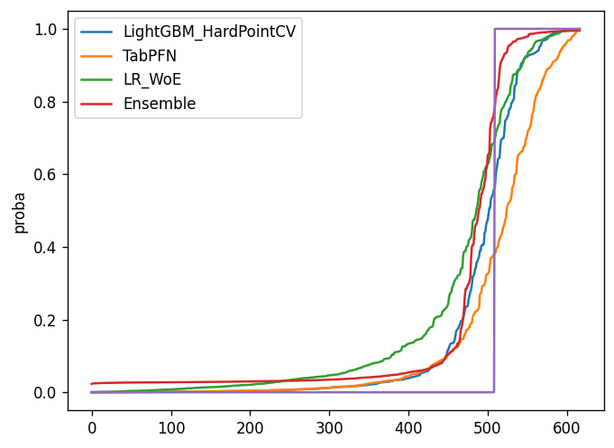

- このdiscussionを参考に多様なモデルをアンサンブルすることにした。(https://www.kaggle.com/competitions/icr-identify-age-related-conditions/discussion/426536)

# モデル1 LightGBM+HardPointCV
## 特徴量
- 全部
## モデル
- LightGBM
- スモールデータだったが、LightGBMとかXGBoostが一番CV、Publicのスコアが良かった。
## CV
- HardPointCVというものを考えてみた。 
- train.csvにはクラス0ぽいのに実はクラス1のデータがあり(509行目とか)、評価指標上こいつらを間違えるとスコアが一気に悪化する。privateにもこういうデータが含まれると思うので検証データに必ず理不尽なデータが1つ含まれるcvを作った。
```python
# HardPoint
hp = [509, 313, 479, 267, 408, 193, 145, 229, 31, 434]
hps = [1 if i in hp else 0 for i in range(len(df_train))]
df_train["HardPoint"] = hps
labels = df_train[["HardPoint", "Class"]]
cv = RepeatedMultilabelStratifiedKFold(n_splits=n_splits, n_repeats=n_repeats, random_state)
```

# モデル2 LogisticRegression + IV_WoE
- こちらを参考(https://www.kaggle.com/code/tatudoug/logistic-regression-baseline/notebook)
- LogisticRegressionだが、cvとpublicで0.17くらい出してて驚いた。
## 特徴量
- 一部厳選、特徴量同士を掛け算したものをIVで選択し、WoEで変換をかけている。
## モデル
- Cはfoldで適宜。
```python
solver="liblinear"
class_weight="balanced"
penalty="l2"
l1_ratio = None
max_iter = 1000

LogisticRegression(C=C, random_state=random_state, l1_ratio=l1_ratio, solver=solver, class_weight=class_weight, penalty=penalty, max_iter=max_iter)
```

## CV
- NestedCV

# モデル3 TabPFN + RepeatedStratifiedKFold
- 謎のTransformer
- TabPFNはクラス0の予測が得意ぽかった。
## 特徴量
- 全部
## モデル
- TabPFN
## CV
- RepeatedStratifiedKFold


# アンサンブル
- 上記3つをLogisticRegressionでstackingした。scipy.minimizeも試したがクラス0の予測確率をかなり高く見積もるのでprivateのスコア爆下がりを警戒して採用しなかった。



# 感想
- GM, Masterの猛者が振り落とされまくってたので、スモールデータかつカラムが多いデータで狙って上位とるのは無理なんかなって思った。
- 当初はルールをシンプルにとか、スコア高すぎず無難に当てるとこ当てるみたいなモデルを作ることが大事かなと思ってたが、そういうのは難しいのかな。